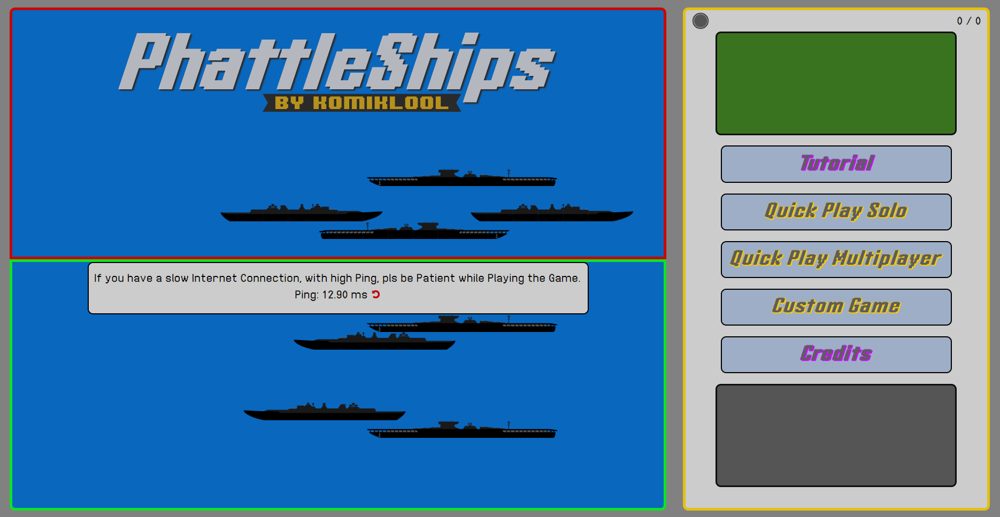
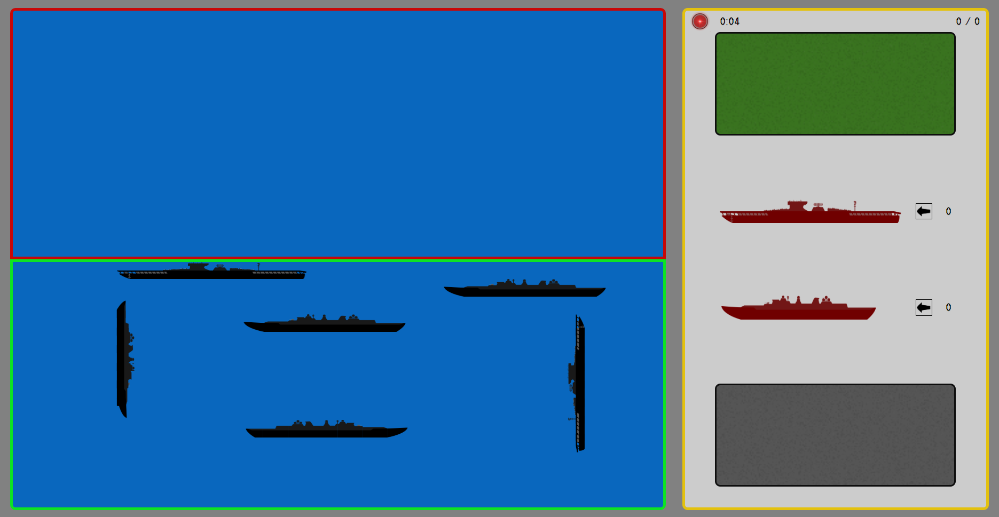

# ⚓ PhattleShips

## 📖 **About the Project**

What if you take the well known Game "Battleship" and give it custom rules and a new twist? That's what I did with PhattleShips. This project was created as a fun way to learn and practice PHP.

The Game contains custom settings for basically everything. You can set the size of the board and the amount of ships. The game is played in rounds, where each player gets a turn to shoot at the enemy ships. The game ends when all ships of a player are destroyed. But while in the Original Rules, a Hit is a Hit, in PhattleShips, a Hit can be a Hit, a Miss or a Critical Hit. A Critical Hit is a Hit that destroys the ship in one go. The Ships have HP instead of the usual 1 Hit to destroy. Other Features i wanted to implement are Aircraft Carriers, Mine Boats and Islands for Base Building. A Fined of mine and me are still on discussion if this is still "Battleship+" or a new Round Based Strategy Game

This Project is with some tweaks and the bare Minimum of features, basically playable. But i lost myself in the Progress and need to start over due to missing Structure and new Knowledge.  

---

## 🚀 **Technologies**

The Project is mostly written in PHP, some HTML and CSS as well as JavaScript. 

For the Connection Between the Players, I used the Javascript/PHP Websocket Library "Ratchet".

If i may be Honest, my code in this Project is a Mess, or how I would say it: It's a complete CLusterfuck. I learned a lot from this Project, but i also learned that i need to plan more and structure my code better. This Project was one of my First Projects and i wanted to challenge myself with it. I already started a new Version of this Project, with completely new Structure and a better Plan with more Knowledge.

---

## 📸 **Screenshots**

Here are some example visuals of PhattleShips:

Working Features Main Menu:

Random Placed Ships 
Refreshing Server Ping 
Credits Page 
Custom Game Page. Containing joining a Multiplayer Game. 
Quick Play Multiplayer. Creating and Starting a Multiplayer Game. 

Working Features InGame:

Red-Lamp/Green-Lamp (Timer till the Round is over)  
Placing Ships in all 4 Directions 
Collsion Check for Ship Placement 
Click on a Ship, Chose an Action and Hit on the Enemy Board 
At Hit on the Enemy, the Ship gets Revealed and a Hit marker is placed on the Board 
Incomming Hit from the Enemy is shown on the Board with Hit marker 
(Damage Logic is not implemented yet) 

---

