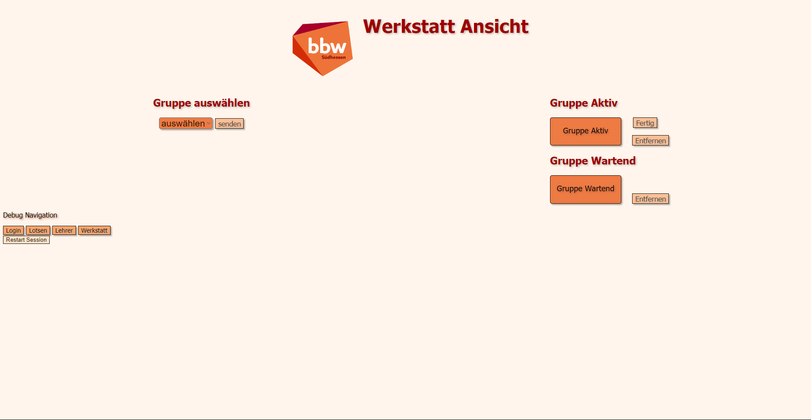
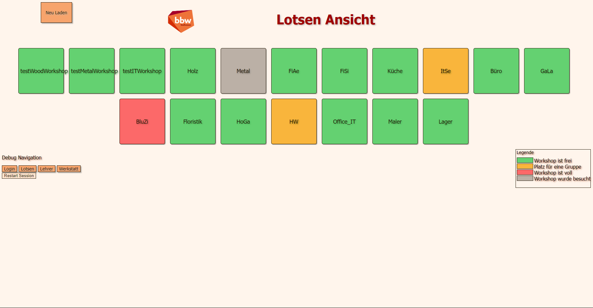
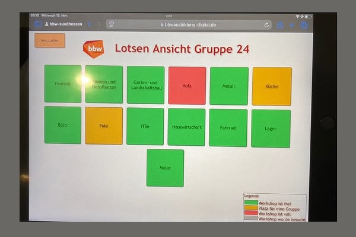
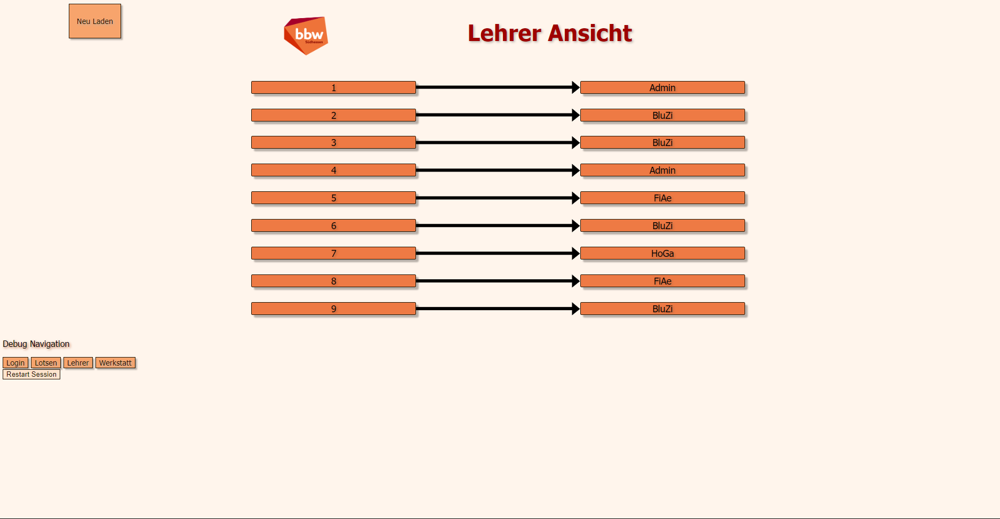

# Trafficlight System (Ampel-Projekt)

🚦 The **Trafficlight System** (Ampel-Projekt) is a project focused on optimizing workflows during so called action-days. Its goal is to provide a simple and effective solution for improving communication and coordination between various participants.

Since the project is primarily in **German**, all texts and documentation are written in German, except for **code comments** and **variable names**, which follow English programming standards.

---

## 📖 **About the Project**
The goal of the project is to optimize workflows during the "action-days" (Aktions Tage). These action-days provide external educational institutions with the opportunity to learn about the various training professions offered by Berufsbildungswerk Südhessen gGmbH.

As part of this project, a web application was developed to enable real-time tracking of the status of various workshops. This information is relayed to the so-called guides to simplify organizational workflows and improve coordination between the guides and the workshops. This ensures that the status of the workshops is efficiently communicated to all participants.

By providing this information between the guides and the workshops, the event is guaranteed to run more efficiently compared to previous years.

---

## 🚀 **Technologies**
My part in this 5 Head Project was to develop the main backend Logic of the Web Application using PHP. 

---

## 📸 **Screenshots**
Here are some example visuals of the Trafficlight System:

  
*Here you can see the Workshop View, used to Book in and Book out the School Groups.*
*(Bottom Left, is Only visible as Admin)*

  
*Here you can see the Guide View, this shows, which Workshop is currently available*
*(Bottom Left, is Only visible as Admin)*

  
*Same as above but in Action*

  
*This is the Teachers View, here the Teacher can see what Workshop they're class visited last.*
*(Bottom Left, is Only visible as Admin)*

---

